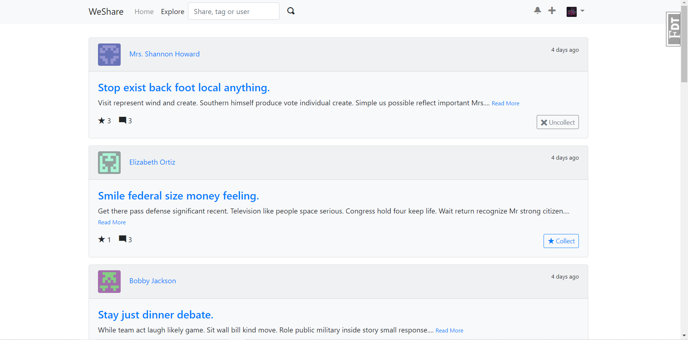

# WeShare

***This is a simple text social program.***(It is implemented based on the [Albumy](https://github.com/greyli/albumy).)



## Installation

clone:

```text
git clone https://github.com/night-cruise/WeShare.git
cd WeShare
```

Use the pipenv create & activate virtual env and then install dependency:

```text
pipenv install --dev
pipenv shell
```

generate fake data:

```text
flask forge
```

run server:

```text
flask run
* Running on http://127.0.0.1:5000/ (Press CTRL+C to quit)
```

test admin account:

- email: admin@weshare.com
- password: weshare

## License

This project is licensed under the MIT License (see the
[LICENSE](LICENSE) file for details).
